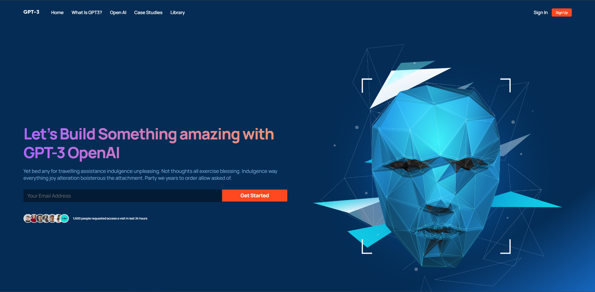
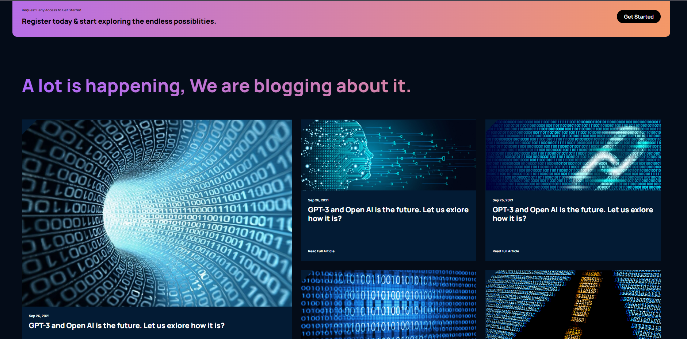

# 🤖 AI Showcase Site — React Project

Добро пожаловать в **AI Showcase** — сайт, созданный на **React**, с акцентом на презентацию возможностей **искусственного интеллекта** 🧠✨  
Этот проект — это современный лендинг/портфолио AI-сервисов, вдохновляющий пользователей исследовать технологии будущего.


---

## 🌐 Демонстрация
https://gptpublication.netlify.app/

## 📸 Скриншоты



---
## 🚀 Как запустить локально

```bash
# 1. Клонируй репозиторий
git clone https://github.com/Badadsher/gpt-web

# 2. Перейди в папку проекта
cd gpt-web

# 3. Установи зависимости
npm install

# 4. Запусти проект
npm run dev

